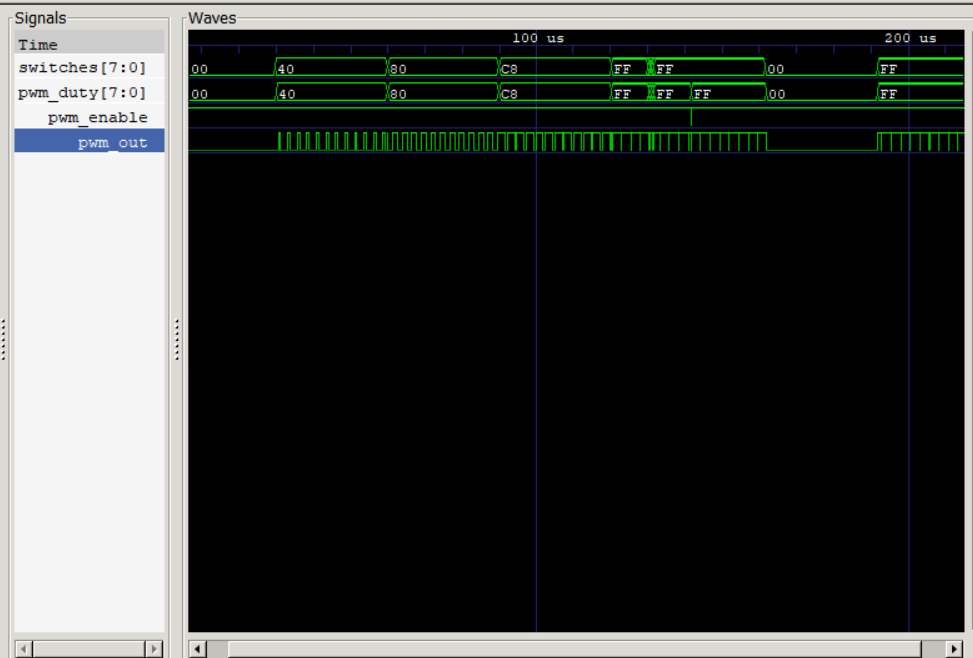

# Test Report: MIPS PWM Motor Controller

## Selected Option

Selected option: B, Read switches -> Write value to PWM duty -> Enable PWM -> Repeat forever.

## Motor Profile Verification

The testbench drives the switch input through the required Option B values while the MIPS program continuously polls MMIO address `0x0090` and writes the sampled value to PWM duty address `0x0098`.



The waveform shows the intended software-hardware path: `switches[7:0]` changes first, then the CPU polling loop performs MMIO activity, `pwm_duty[7:0]` updates, and `pwm_out` changes pulse width. `mem_addr` includes the MMIO addresses used by the program, including the switch read address `0x90`, PWM duty address `0x98`, and PWM enable address `0x9C`.

## Tested Switch Values

| Switch value | Expected duty |
|---|---|
| `8'h40` | `pwm_duty = 8'h40`, about 25% duty. |
| `8'h80` | `pwm_duty = 8'h80`, about 50% duty. |
| `8'hC8` | `pwm_duty = 8'hC8`, about 78% duty. |
| `8'hFF` | `pwm_duty = 8'hFF`, almost 100% duty. |

The testbench also starts at `8'h00` and applies rapid switch changes.

## PWM Duty Verification

For each switch transition, the CPU polling loop eventually performs:

```asm
lw $t0, 0($t1)   # t1 = 0x0090
sw $t0, 0($t2)   # t2 = 0x0098
```

In GTKWave, `mem_addr` shows reads from `0x00000090` and writes to `0x00000098`. On the write cycle, `write_data[7:0]` matches the sampled switch value, and `pwm_duty[7:0]` updates after the write clock edge.

## PWM Output Pulse-Width Verification

`pwm_out` is generated only by `pwm_controller`. With `pwm_enable = 1`, the high portion of each 256-count PWM period increases as `pwm_duty` increases. At `duty = 0`, `pwm_out` remains low. At `duty = 255`, `pwm_out` is high for 255 counts and low for one count.

## Assembly-to-Waveform Explanation

The first three instructions write `1` to address `0x009C`, enabling the PWM. The next two instructions load the MMIO base addresses for switches and duty. The loop repeatedly reads switches from `0x0090`, writes the same value to `0x0098`, and jumps back to repeat. The `lw` followed by dependent `sw` also exercises the load-use stall logic.

## Edge Cases Tested

| Edge case | How it is tested | Expected result |
|---|---|---|
| Enable = 0 | During reset and reset-in-operation section. | `pwm_enable = 0`, `pwm_out = 0`. |
| Duty = 0 | Initial switch value and later `switches = 8'h00`. | `pwm_duty = 0`, `pwm_out = 0` after CPU writes duty. |
| Duty = 255 | `switches = 8'hFF`. | PWM output is high for almost the full period. |
| Rapid switch changes | `10`, `F0`, `20`, `FF` are applied close together. | CPU samples through polling; duty changes only after real MMIO writes. |
| Reset during operation | `rst_n` is asserted low after PWM has been active. | PWM registers reset to zero, then software restarts and re-enables PWM. |

## Manual GTKWave Inspection

Open `mips.vcd` with `make wave` and inspect `switches[7:0]`, `pwm_duty[7:0]`, `pwm_enable`, `pwm_out`, `pc_out`, `mem_write`, `mem_addr`, `write_data`, and `read_data`. The included `docs/waveform_profile.png` is a captured summary of the same VCD evidence.
